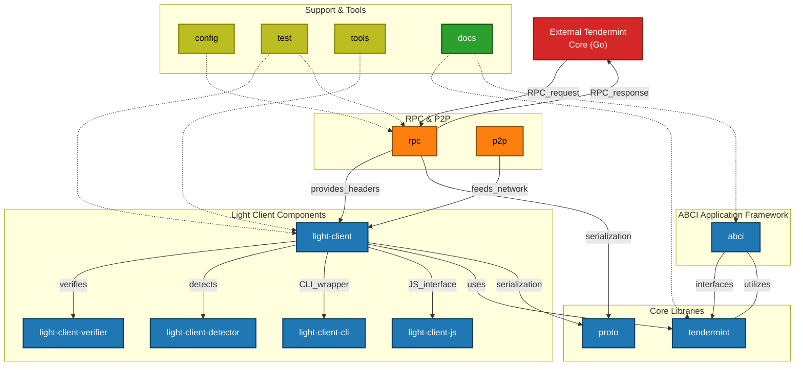

# tendermint-rs

[![Crate][crate-image]][crate-link]
[![Docs][docs-image]][docs-link]
[![Build Status][build-image]][build-link]
[![Audit Status][audit-image]][audit-link]
[![Apache 2.0 Licensed][license-image]][license-link]
![Rust Stable][rustc-image]

[Tendermint] in Rust with [TLA+ specifications](/docs/spec).

Tendermint is a high-performance blockchain consensus engine for Byzantine fault
tolerant applications written in any programming language.

## Tendermint Core Compatibility

tendermint-rs has been tested for compatibility with Tendermint Core v0.34.21.

## Requirements

Tested against the latest stable version of Rust. May work with older versions.

### Semantic Versioning

We do our best to follow [Semantic Versioning](https://semver.org/). However, as
we are pre-v1.0.0, we use the MINOR version to refer to breaking changes and the
PATCH version for features, improvements, and fixes.

We use the same version for all crates and release them collectively.

## Documentation

See each component for the relevant documentation.

Libraries:

- [tendermint](./tendermint) - Tendermint data structures and serialization
- [tendermint-abci](./abci) - A lightweight, low-level framework for building
  Tendermint ABCI applications in Rust
- [tendermint-light-client](./light-client) - Tendermint light client library
  for verifying signed headers and tracking validator set changes
- [tendermint-light-client-detector](./light-client-detector) - Library for
  detecting and reporting attacks against the Tendermint light client
- [tendermint-light-client-cli](./light-client-cli) - CLI for the light client,
  for verifying headers, detecting attacks and reporting them.
- [tendermint-light-client-js](./light-client-js) - Low-level WASM interface for
  interacting with the Tendermint light client verification functionality
- [tendermint-p2p](./p2p) - At present this primarily provides the ability to
  connect to Tendermint nodes via Tendermint's [secret connection](tendermint-secret-conn)
- [tendermint-proto](./proto) - Protobuf data structures (generated using Prost)
  for wire-level interaction with Tendermint
- [tendermint-rpc](./rpc) - Tendermint RPC client and response types

## Releases

Release tags can be found on
[GitHub](https://github.com/informalsystems/tendermint-rs/releases).

Crates are released on [crates.io](https://crates.io).

## Contributing

The Tendermint protocols are specified in English in the [tendermint/tendermint
repo](https://github.com/tendermint/tendermint/tree/main/spec). Any protocol
changes or clarifications should be contributed there.

This repo contains the TLA+ specifications and Rust implementations for various
components of Tendermint. See the [CONTRIBUTING.md][contributing] to start
contributing.

## Resources

Software, Specs, and Documentation

- [Tendermint Datastructures Spec](https://github.com/tendermint/spec)
- [Tendermint in Go](https://github.com/tendermint/tendermint)
- [Docs for Tendermint in Go](http://docs.tendermint.com/)

Papers

- [The latest gossip on BFT consensus](https://arxiv.org/abs/1807.04938)
- [Ethan Buchman's Master's Thesis on Tendermint](https://atrium.lib.uoguelph.ca/xmlui/handle/10214/9769)

## License

Copyright © 2020 Informal Systems and contributors

Licensed under the Apache License, Version 2.0 (the "License");
you may not use the files in this repository except in compliance with the License.
You may obtain a copy of the License at

    https://www.apache.org/licenses/LICENSE-2.0

Unless required by applicable law or agreed to in writing, software
distributed under the License is distributed on an "AS IS" BASIS,
WITHOUT WARRANTIES OR CONDITIONS OF ANY KIND, either express or implied.
See the License for the specific language governing permissions and
limitations under the License.

[//]: # (badges)

[crate-image]: https://img.shields.io/crates/v/tendermint.svg
[crate-link]: https://crates.io/crates/tendermint
[docs-image]: https://docs.rs/tendermint/badge.svg
[docs-link]: https://docs.rs/tendermint/
[build-image]: https://github.com/informalsystems/tendermint-rs/workflows/Rust/badge.svg
[build-link]: https://github.com/informalsystems/tendermint-rs/actions?query=workflow%3ARust
[audit-image]: https://github.com/informalsystems/tendermint-rs/workflows/Audit-Check/badge.svg
[audit-link]: https://github.com/informalsystems/tendermint-rs/actions?query=workflow%3AAudit-Check
[license-image]: https://img.shields.io/badge/license-Apache2.0-blue.svg
[license-link]: https://github.com/interchainio/tendermint-rs/blob/master/LICENSE
[rustc-image]: https://img.shields.io/badge/rustc-stable-blue.svg

[//]: # (general links)

[tendermint-docs-link]: https://docs.rs/tendermint/
[tendermint-rpc-docs-link]: https://docs.rs/tendermint-rpc/
[Tendermint]: https://github.com/tendermint/tendermint
[tendermint-light-client-docs-link]: https://docs.rs/tendermint-light-client/
[tendermint-secret-conn]: https://github.com/tendermint/tendermint/blob/v0.34.x/spec/p2p/peer.md#authenticated-encryption-handshake
[contributing]: ./CONTRIBUTING.md
